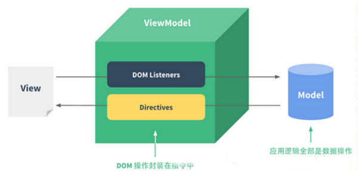

### 一、渐进式框架 Vue

vue 官网说：Vue.js（读音 /vjuː/，类似于 view） ==是一套构建用户界面的渐进式框架。与其他重量级框架不同的是，Vue 采用自底向上增量开发的设计。
渐进式我个人理解就是阶梯式向前。vue 是轻量级的，它有很多独立的功能或库，我们会根据我们的项目来选用 vue 的一些功能。就像我们开发项目时如果只用到 vue 的声明式渲染，我就只用 vue 的声明渲染，而我们要用他的组件系统，我们可以引用它的组件系统。
vue 的渐进式表现为：

声明式渲染——组件系统——客户端路由——-大数据状态管理——-构建工具

### 二、vue 中两个核心点

1.响应式数据绑定
当数据发生变化是，vue 自动更新视图
它的原理是利用了 Object.definedProperty 中的 setter/getter 代理数据，监控对数据的操作。（这也是为什么 vue 不支持 ie8 以及更早的 ie 浏览器的原因）

2.组合的视图组件

ui 页面映射为组件书

划分组件可维护、可重用、可测试

这里写图片描述

### 三、虚拟 DOM

js 的运行速度已经很快了，然而大量的 DOM 操作就会变得很慢，但是前端本身就是要通过 JS 处理 DOM 来更新视图数据的。 这样在更新数据后会重新渲染页面，这样就造成在没有改变数据的地方也重新渲染了 DOM 节点。这样性能方面就会很受影响。

利用在内存中生成与真实 DOM 与之对应的数据结构，这个在内存中生成的结构称之为虚拟 DOM。
当数据发生变化时，能够智能的计算出重新渲染组件的最小代价并应用到 DOM 操作上。vue 就是利用了这一点。（vue 渲染组件的步骤图：）

vue 渲染组件的步骤图

### 四、MVVM 模式

可能你经常听说 MVC 模式 和 MVVM 模式。
angular 就是所谓的 MVC 模式的框架，model 、view、controller。
而 vue 是 MVVM 模式的框架，即
M： model （数据层，也就是指数据（前端是 js））
V：view ( 也就是指 DOM 层 或用户界面 )
VM : view-model (处理数据和界面的中间层，也就是指 Vue)

vue 的 MVVM 模型图

### 五、Vue 实例

每一个应用都是通过 Vue 这个构造函数来创建根实例启动的（new Vue()）
构造函数中需要传入一些选项对象。包含挂在元素、数据、模板、方法等等、

六、声明式渲染（命令式渲染）
渲染时分为 声明式渲染 和 命令式渲染 的

1.  Vue 是声明式渲染的，
    也就是 只需要关心 声明在哪里（where） 做什么（what），而不需要关心是如何实现的（how） 2.命令式渲染
    需要通过具体的代码表达在哪里（where） 做什么（what）,如何实现（how）

###六、总结
在 vue 使用中一定要注意一些细节，如复制相同的页面时，一定要把外层 DIV 名字改了，不然会引起样式冲突，
在 vue 使用 activetd 时候，一定要清空一些状态数据等，不然在页面来回跳转的时候，会显示上一次的状态。
