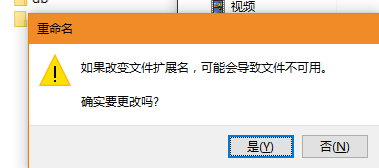

# MongoDB 安装

## 一、下载

MongoDB[下载](https://pan.baidu.com/s/1vp02QmI87Qes6mbIw1KS-w)，密码：n3a0，按需下载即可 

## 二、安装

1.  mongodb 安装 
    安装过程就跟安装普通软件没什么两样，mongodb 的安装路径也是可以更改为自定路径的（在 custom 选项处更改），但要注意 mongodb 的安装位置，后面配置环境变量或者作为 windows 服务启动时需要用到这个路径。<label style="color:red">**PS：我是默认安装的，请一定记住 mongodb 的安装位置！！！**</label> 
    <label style="color:red">**这是我安装 mongodb 成功后的文件：**</label> 
     
1.  可视化工具(mongobooster)安装 
    就是普通软件安装，可以自定安装位置，也可以使用默认的，然后下一步... 
    安装成功，启动： 
     
    请先这样，目前无需配置，要等 mongodb 配置后再来配置

## 三、配置

1.  配置成环境变量 
    **win10 系统：** 
    桌面上此电脑图标=>右键=>属性=>高级系统设置=>环境变量=>Path=>编辑=>新建=>把 mongodb 的安装目录的 bin 文件路径复制进去=>保存即可。 
     
    **win7 系统：** 
    我的电脑=>右键=>属性=>高级系统设置=>环境变量=>系统变量=>path
    但 win7 的 path 都显示在一行的，实在不好看，同样把 bin 目录复制进去就好，但注意以英文状态的分号间隔
1.  创建 log，db 文件夹 
    之前安装的其实是数据服务器，通过数据库服务器可以建立很多个数据库，而要把我们新建的数据库放在哪儿是可以我们自己决定的，所以需要指定一个位置来放数据库(db)和日志(log) 
    我的建在 H:\hzq 下：
    -   在此建立一个文件夹 mongodb，并且建立子目录 db（存放数据库文件）和 log（存放数据库日志文件） 
         
    -   在 log 目录下建立一个文件 MongoDB.log，后缀为.log。 
        进入 log 目录=>右键=>新建=>文本文档=>取名为 MongDB.log，将.txt 删掉=>确定=>系统提示=>=>点击"是" 
        创建完成，效果如下： 
         
1.  启动服务 
    运行 cmd，直接输入以下命令：`mongod --dbpath "H:\hzq\mongodb\db"` 
    PS：dbpath 就是刚才你创建的文件夹里的 db 路径，为数据库路径
    运行成功：
     
1.  将 mongodb 安装为 windows 服务 
    当 mongod.exe 被关闭时，mongo.exe 就无法连接到数据库了，因此每次想使用 mongodb 数据库都要开启 mongod.exe 程序，所以比较麻烦，此时我们可以将 MongoDB 安装为 windows 服务。 
    以<label style="color:red">**管理员身份运行 cmd**</label>，进入到 mongodb 安装路径里面的 bin 文件夹
    这是我的 bin 文件夹，<label style="color:red">**PS：管理员身份运行 cmd**</label>
     
     
    然后输入以下命令
    `Mongod --dbpath "H:\hzq\mongodb\db" --logpath "H:\hzq\mongodb\log\MongoDB.log" --install --serviceName "MongoDB"` 
    <label style="color:red">**PS：请注意空格哦！！！ 这里 MongoDB.log 就是开始建立的日志文件，--serviceName "MongoDB" 服务名为 MongoDB**</label>
     
    运行成功后，然后启动 mongodb 服务,输入：`net start MongoDB`
     
    <label style="color:red">**PS：我的已经启动了，所以是这样的结果**</label> 
    最后输入 `mongo` 成功连接时，情况如下：
     
    <label style="color:red">**以上 mongodb 安装配置步骤全部参考[此处](https://blog.csdn.net/sophie_u/article/details/53088891)，我只是删除了些不需要的步骤，如有需要请看[原文档](https://blog.csdn.net/sophie_u/article/details/53088891)。**</label> 
