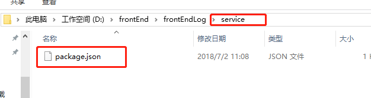
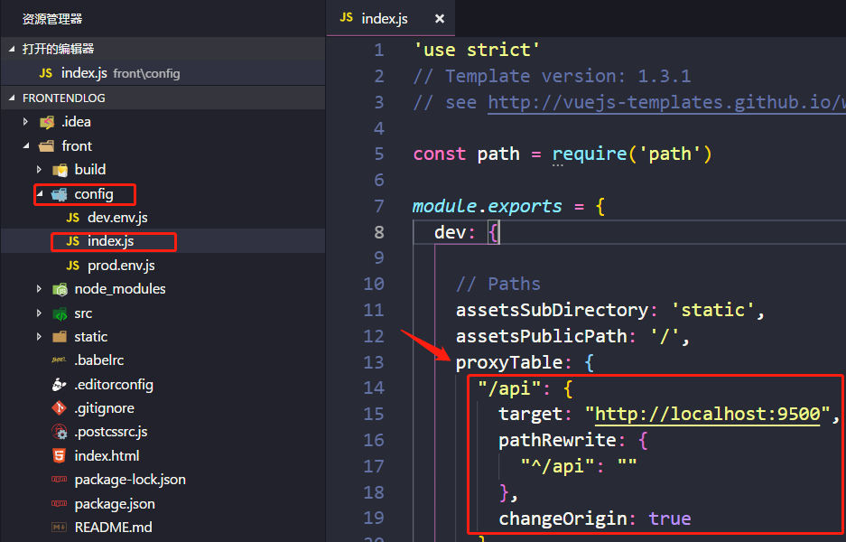
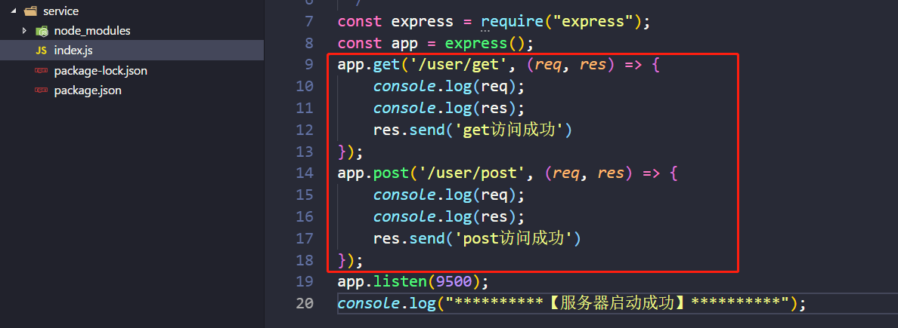
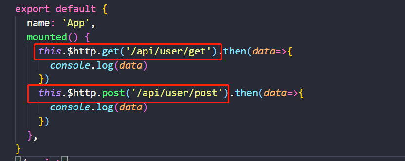
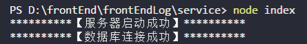
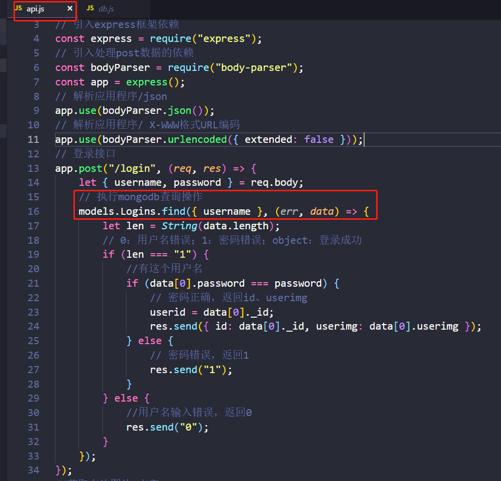

# Vue+Express+MongoDB 项目搭建

## 一、 Express 项目搭建

1.  **安装 Node.js**<br>
    请先安装[Node.js](https://nodejs.org/zh-cn/)
1.  **项目搭建**<br>
    1.  **创建文件夹**<br>
        请先找一个地方，创建一个文件夹，我取名为 service，名字请随意。通过命令行就入该文件，然后输入 `npm init`，初始化一个 node 项目，之后一直 `enter` 到结束。现在 service 文件夹里面就有一个 `package.json` 文件了
        
    1.  **安装**<br>
        命令行输入 `npm install express --save`，会自动生成一个`node_modules`文件夹和`package-lock.json`。
    1.  **搭建服务器**<br>
        在 server 里面新建一个`index.js`文件，然后编辑 index.js。
    1.  **编辑 index.js(入口文件)**
        ```ruby
        const express = require("express");
        const app = express();
        app.listen(5000, () => console.log('**********【服务器启动成功】**********'));
        ```
    1.  **启动服务器**<br>
        在命令行输入`node index`，即可启动成功，并且会打印 `**********【服务器启动成功】**********`

## 二、Vue 单页面项目构建

1.  **安装 vue-cli**<br>
    请先全局安装`vue-cli`，命令为：进入`cmd`，然后输入`npm install vue-cli -g`
1.  **单页面构建**<br>
    找个文件夹，进入 cmd 命令行，输入：`vue init webpack proName`，其中的`proName`：是你的项目名称，可以随意取名。然后就是依据提示，`enter`下去，安装完成后，`cd proName`，运行`npm install`，完成后`npm run dev`，会默认打开一个浏览器，里面是 vue 的 logo，则 vue 单页面项目构建成功

## 三、Vue 与 Express 连接

1.  **Vue 代理配置**<br>
    请在`config`—`index.js`下面，往`dev.proxyTable`里面添加代理代码

```ruby
    "/api": {
        target: "http://localhost:5000",//接口的域名
        pathRewrite: {
          "^/api": ""//需要将/api重写为''
        },
        secure: false,// 如果是https接口，需要配置这个参数
        changeOrigin: true// 如果接口跨域，需要进行这个参数配置
      }
```



1.  **Node—index.js(入口文件)**<br>
    1.  请在`index.js`里面这样写 get、post 接口
        
    1.  `（请先安装axios哦）`然后，在 vue 这样访问 get、post 时：
        
    1.  最后请分别运行 node 和 vue

## Express 与 MongoDB 连接

1.  **db.js(数据库文件)**<br>

    1.  连接数据库<br>
        请先在 service 下，进入 cmd，然后运行 `npm install mongoose --save`，安装 mongoose 依赖,，它是一个 MongoDB 对象建模工具
        然后在 service 下新建一个 db.js，用于 mongodb 数据库的配置

        ```ruby
        引入mongoose依赖
        const mongoose = require("mongoose");
        连接mongodb数据库
        参数1：mongodb数据库启动的地址
        参数2：回调函数，用于判断是否连接成功
        mongoose.connect("mongodb://localhost/Test", err => {
            if (err) console.log("**********【数据库连接失败】**********");
            else console.log("**********【数据库连接成功】**********");
        });
        要导出的模型Model
        const Models = {};
        module.exports = Models;
        ```

        然后在`index.js`顶部里面引入该文件
        `const models = require("./db");`<br>
        最后运行 `node index`<br>
        <br>
        表明数据库连接成功啦

    1.  数据库操作<br>
        [Mongoose 文档](https://mongoose.shujuwajue.com/guide/schemas.html)<br>
        请先 db.js 里面加上以下代码，具体原因需要自行学习 mongoose 文档<br>
        a.定义`Schema(模式)`
        ```ruby
        登录模式
        const logins = new mongoose.Schema({
            username: String,
            password: String,
            userimg: {
                type: String,
                default: "avatar0" //用户默认头像
            }
        });
        ```
        b.定义`Model(模型)`
        ```ruby
        要导出的模型Model
        const Models = {
            Logins: mongoose.model("logins", logins)
        }
        导出模型
        module.exports = Models;
        ```
        c.然后在 index.js 里面的登陆接口写数据库操作
        <br>
        就可完成对数据库的操作。

## 以上内容就完成了：vue 连接 node 服务器，node 服务器连接 mongodb 数据
