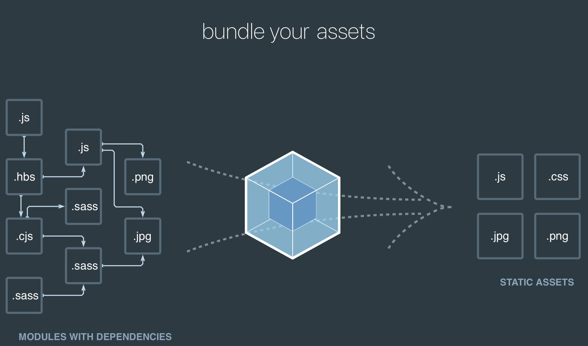
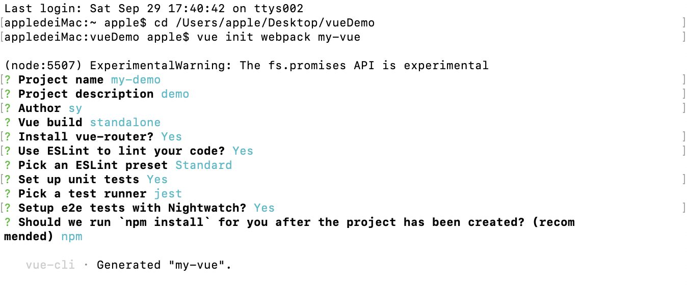
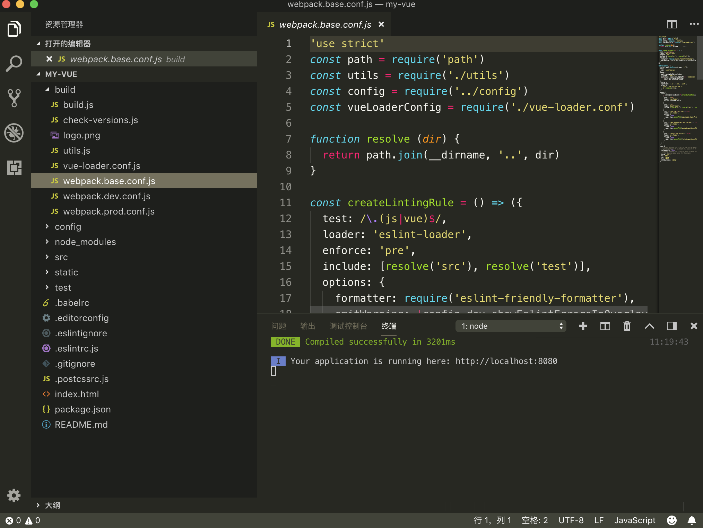
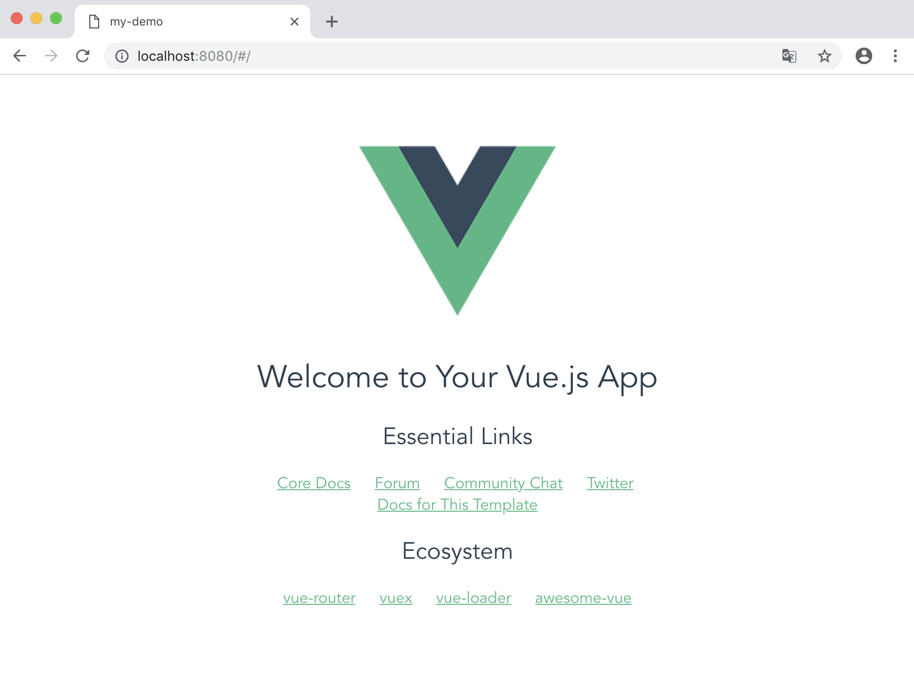

webpack入门和搭建一个基于vue+webpack的新项目

###### @copyright 沈勇 2018-9-29

#### webpack是什么？



官方文档的描述是:本质上，**webpack** 是一个现代 JavaScript 应用程序的*静态模块打包器(static module bundler)*。在 webpack 处理应用程序时，它会在内部创建一个*依赖图(dependency graph)*，用于映射到项目需要的每个模块，然后将所有这些依赖生成到一个或多个*bundle*。

简单来说webpack是模块化管理工具，使用webpack可以对模块进行压缩、预处理、按需打包、按需加载等。

#### 为什么要使用webpack?

在前端开发里面随着js能做的事情越来越多，引用越来越多，文件越来越大，对js文件的压缩和合并的需求越来越强烈，为了解决这些问题模块化这个概念就出来了，在webpack中所有的文件资源、js代码、css、图片等都被模块化，模块化后造成的问题就是需要额外的处理才能让浏览器识别，而手动处理又十分的繁琐，所以webpack能够分析你的项目结构，找到JavaScript模块以及其它的一些浏览器不能直接运行的拓展语言（Scss，TypeScript等），并将其转换和打包为合适的格式供浏览器使用。

#### webpack有哪些重要特性

`插件化`：webpack本身非常灵活，提供了丰富的插件接口。基于这些接口，webpack开发了很多插件作为内置功能。

`速度快`：webpack使用异步IO以及多级缓存机制。所以webpack的速度是很快的，尤其是增量更新。

 `丰富的Loaders`：loaders用来对文件做预处理。这样webpack就可以打包任何静态文件。 

`高适配性`：webpack同时支持`AMD`/`CommonJs`/`ES6`模块方案。webpack会静态解析你的代码，自动帮你管理他们的依赖关系。此外，webpack对第三方库的兼容性很好。 

`代码拆分`：webpack可以将你的代码分片，从而实现按需打包。这种机制可以保证页面只加载需要的JS代码，减少首次请求的时间。

 `优化`：webpack提供了很多优化机制来减少打包输出的文件大小，不仅如此，它还提供了hash机制，来解决浏览器缓存问题。

 `开发模式友好`：webpack为开发模式也提供了很多辅助功能。比如SourceMap、热更新等。

 `使用场景多`：webpack不仅适用于`web应用`场景，也适用于`Webworkers`、`Node.js`场景

#### webpack如何最佳配置

webpack官方提供的配置方法是通过module.exports返回一个json，但是这种场景不灵活，不能适配多种场景。
比如要解决：production模式和development模式，webpack的配置是有差异的，大致有两种思路。
1、两份配置文件`webpack.config.production.js/webpack.config.development.js`，然后不同场景下，使用不同的配置文件。
2、通过module.exports返回函数，该函数能接受参数。

相对来说，第一种更简单，但是重复配置多；第二种更灵活，推荐第二种方式。
那么，按返回函数的方式的配置代码架子如下：

```
module.exports = function(env) {
    return {
        context: config.context,
        entry: config.src,
        output: {
            path: path.join(config.jsDest, project),
            filename: '[name].js',
            chunkFilename: '[name].[chunkhash:8].js',
            publicPath: '/assets/' + project + '/'
        },
        devtool: "eval",
        watch: false,
        profile: true,
        cache: true,
        module: {
            loaders: getLoaders(env)
        },
        resolve: {
            alias: getAlias(env)
        },
        plugins: getPlugins(env)
    };
}
```

配置里面各个关键字的意思如下：

 ` context`：上下文。

 `entry`：入口文件，是所有依赖关系的入口，webpack从这个入口开始静态解析，分析模块之间的依赖关系。 

 `output`：打包输出的配置。

 `devtools`：SourceMap选项，便于开发模式下调试。

 `watch`：监听模式，增量更新，开发必备！

 `profile`：优化。

 `cache`：webpack构建的过程中会生成很多临时的文件，打开cache可以让这些临时的文件缓存起来，从而更快的构建。

 `module.loaders`：如前文介绍，loaders用来对文件做预处理。这样webpack就可以打包任何静态文件。 

 `resolve.alias`：模块别名，这样可以更方便的引用模块。

 `plugins`：如前文介绍，webpack的一些内置功能均是以插件的形式提供。

---

#### 搭建vue脚手架

我们现在常用的开发框架vue提供了一个叫vue-cli的官方命令行工具，可用于快速搭建大型单页应用。该工具提供开箱即用的构建工具配置，带来现代化的前端开发流程。只需几分钟即可创建并启动一个带热重载、保存时静态检查以及可用于生产环境的构建配置的项目：

```
# 全局安装 vue-cli
$ cnpm install --global vue-cli
```

要创建项目，首先我们要选定目录，然后再命令行中把目录转到选定的目录。可以使用：

```
#my-project为自定义项目名
$ vue init webpack my-project
```

运行初始化命令的时候回让用户输入几个基本的选项，如项目名称，描述，作者等信息，如果不想填直接回车默认就好，如下图所示



初始化选项的意思如下：

```
Project name (my-project) # 项目名称（我的项目）

Project description (A Vue.js project) # 项目描述一个Vue.js 项目

Author 作者（你的名字）

Install vue-router? (Y/n) # 是否安装Vue路由，也就是以后是spa（但页面应用需要的模块）

Use ESLint to lint your code? (Y/n) # 使用 ESLint 到你的代码？ （Y [ yes ] / N [ no ]）

Pick an ESLint preset (Use arrow keys) # 选择一个预置ESLint（使用箭头键）

Setup unit tests with Karma + Mocha? (Y/n) # 设置单元测Karma + Mocha？ （Y/ N）

Setup e2e tests with Nightwatch? (Y/n) # 设置端到端测试，Nightwatch？ （Y/ N）
```

然后安装依赖

```
cnpm install
```

安装成功后运行

```
cnpm run dev
```

项目启动成功





以上就是vue的脚手架搭建过程，看到如上界面就表示配置成功了。

